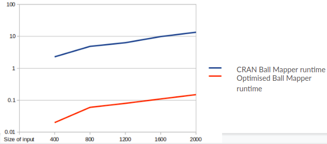

# Ball Mapper Optimisation

This repository contains an optimised version of the Ball Mapper Algorithm
To know more about the Ball Mapper Algorithm visit: [CRAN package of Ball Mapper Algorithm](https://cran.r-project.org/web/packages/BallMapper/index.html). The relevant files are also included in this repp in `R` folder for easy reference. 

In this repo, the `ball.cpp` file contains the optimised code
The optimisations are:
- The quadratic procedure of finding and removing duplicate edges has been optimised to $O(nlogn)$. This refers to [this block](https://github.com/icoder211/BallMapperOptimisation/blob/main/R/BallMapper.R#L129-L162)
- The code has been deployed in C++, speeding up the runtime by **100 times**

## How to use
- Run `ball.cpp` with input file name and epsilon as command line arguments
- The results are stored in files in the root folder
- To use the results in the R file (for visualisations etc) use `readBallMapperGraphFromFile` with `FILENAME` (in ball.cpp) as argument

## Results
The Boston property dataset (/R/data) was modified to create datasets of different sizes and here are the runtimes of the CRAN implementation and our C++ code:

As can be seen, there is a consistent 100x improvement in runtime.
